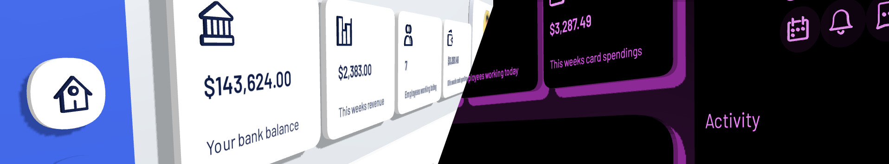

# @coconut-xr/koestlich

_user interfaces for Three.js_

This library builds on [yoga](https://github.com/facebook/yoga) (open-source flexbox implementation), [Three.js](https://github.com/mrdoob/three.js) (open-source WebGL library) to deliver **compatible and performant 3D UIs** with **out-of-the-box animations**.

We currently provide bindings to [react-three/fiber](https://github.com/pmndrs/react-three-fiber), enabling a **familiar Developer Experience** for react developers.

`npm install @coconut-xr/koestlich`

[⤷ Getting Started](https://coconut-xr.github.io/koestlich/#/getting-started)

## Examples

- [Dashboard](https://codesandbox.io/s/koestlich-dashboard-example-8hjx90)

## [Documentation](https://coconut-xr.github.io/koestlich)

- [Getting Started](https://coconut-xr.github.io/koestlich/#/getting-started)
  introduces **koestlich**'s features by example
- [Advanced](https://coconut-xr.github.io/koestlich/#/advanced)
  introducing classes, default styles, and custom property APIs
- [Components](https://coconut-xr.github.io/koestlich/#/components)
  Description of available components and their API
- [Library Development](https://coconut-xr.github.io/koestlich/#/library-development)
  information for developing custom component libraries

## Ecosystem

- WebXR Interactions - [@coconut-xr/natuerlich](https://github.com/coconut-xr/natuerlich)
- Text Fields & Text Areas - [@coconut-xr/input](https://github.com/coconut-xr/input)
- Pre-designed UI Components - [@coconut-xr/apfel-kruemel](https://github.com/coconut-xr/apfel-kruemel)
- Lucice Icons for Koestlich - [@coconut-xr/lucide-koestlich](https://github.com/coconut-xr/lucide-koestlich)

## React Native

Use `expo-three` and overwrite the `PlatformConstants.TextureLoader` with the `TextureLoader` from `expo-three`:
[Example](https://github.com/coconut-xr/koestlich-expo-test)
