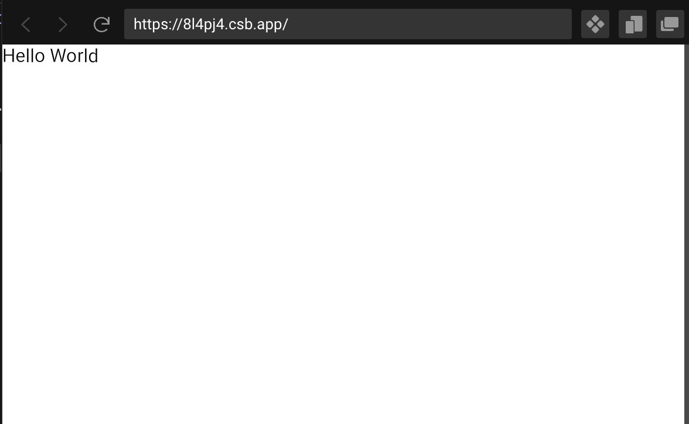

# Library Development

We encourage developing custom component libraries on top of Koestlich. However, building custom components for evironments that are arbitrarly scaled, requires a standard for scaling. Therefore, we provide the `KoestlichTestCanvas` component. The `KoestlichTestCanvas` allows to test the scaling of a component by scaling it so that one unit unside the UI matches one pixel (based on the provided "pixel size" from the browser). This allows custom components to adhear the sizing conventions of the web.

The following setup shows how the `KoestlichTestCanvas` component can be used to test the sizing of the default text element.

[CodeSandbox](https://codesandbox.io/s/koestlich-scale-test-env-8l4pj4?file=/src/app.tsx)



```tsx
import { KoestlichTestCanvas, Text } from "@coconut-xr/koestlich";

export default function App() {
  return (
    <KoestlichTestCanvas>
      <Text>Hello World</Text>
    </KoestlichTestCanvas>
  );
}
```

We provide a starting point for implementing many custom components like Sliders, Dropdown, Tabs, and more [here](https://github.com/coconut-xr/kruemel).